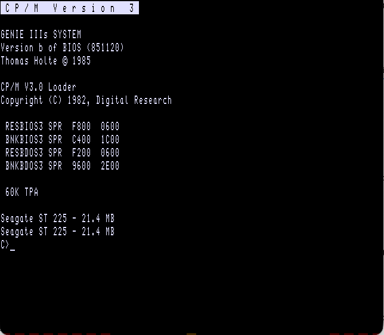

<!-- /OMTI_USAGE.md — running sdltrsOMTI with a working OMTI hard disk -->

# Running sdltrsOMTI with a working OMTI hard disk

Usage guide. For the controller protocol, see `OMTI_CONTROLLER.md`. For the debugging history behind these choices, see `DEBUG.md`.



## 1. Build

```sh
mkdir -p build && cd build && cmake .. && cmake --build .
```

The binary is `build/sdl2trs`. Rebuild after any change under `src/` (`cmake --build build` from the repo root). On macOS the `sdl2trs` window is resizable.

## 2. Which `.hdv` to use

Use `HDV/g3s-omti-WORKING.hdv`. It is the only correct and complete OMTI image in `HDV/` (the rest are just test images):

- Full 615-cylinder / 21.4 MB size, which the D: partition needs
- Boots directly from the raw hard-disk EPROM with no floppy attached
- Both C: and D: are valid, clean CP/M partitions

One `.hdv` is one physical drive holding two logical CP/M drives, C: and D:. You attach it once at `-omti0`; there is no separate file or slot for D:. The OMTI controller has no notion of C: or D:, so to the emulated hardware `-omti0` is a single flat block device. The split lives in the guest CP/M BIOS: `DISKIO1.MAC` (`DPBHD1`/`DPBHD2`) reads and writes the one image at two cylinder offsets, C: from cylinder 2 and D: from cylinder 307, where C: ends. The 1990s hardware worked the same way: one physical Seagate ST225 partitioned in software.
<!-- TODO(1): an unfinished sentence "The message about ..." was left here. Delete it or finish the thought? The doubled "Seagate ST 225" banner is already explained in section 7. -->


`g3s-omti-WORKING.hdv` is a live disk, not a template. Files you write to it (below) persist. To keep a pristine copy, back it up:

```sh
cp HDV/g3s-omti-WORKING.hdv HDV/g3s-omti-WORKING.backup.hdv
```

To build a fresh one from scratch, see the docstring in `dmk-working/build_working_hdv.py` — a scripted, reproducible recipe that works around a bug in the original `COPYSYS.COM` (see `DEBUG.md`).
<!-- TODO(2): a dangling "I needed to do this" was left here — finish the thought or remove it. -->

## 3. One-click launch

Double-click `sdl2trs-omti.command` (repo root) in Finder. It boots straight into `HDV/g3s-omti-WORKING.hdv` with no floppy and no flags to remember, running the section 4 command with everything filled in. If your ROM archive isn't at the default path it checks (`~/path/to/GitHub/GenieIIIs/rom/...`), edit `ROM_PATH` near the top of the file.

The script reads `~/.sdltrs.t8c` (the config file `sdl2trs` maintains) before applying its own flags. If you previously attached something to a floppy or hard slot through the GUI and saved config (Alt-menu → "Configuration/State Files"), it stays attached, because `sdl2trs` does not auto-save on quit and an omitted flag never clears a slot. The script clears every `disk` and `hard` slot itself, so this is safe either way.

## 4. Boot directly from the hard disk (no floppy), manually

```sh
./build/sdl2trs -model 1 \
  -rom "/path/to/g3s_hd-omti_bootrom_2764.bin" \
  -disk0 "" -disk1 "" -disk2 "" -disk3 "" -disk4 "" -disk5 "" -disk6 "" -disk7 "" \
  -hard0 "" -hard1 "" -hard2 "" -hard3 "" \
  -omti0 HDV/g3s-omti-WORKING.hdv -omti1 "" \
  -nofullscreen
```

The empty (`""`) slots matter. `~/.sdltrs.t8c` keeps whatever was last attached to each slot, and an omitted flag does not clear a stale value.

This boots straight to a `C>` prompt: the `GENIE IIIs SYSTEM` banner, the CP/M V3.0 loader banner, all four system components, then `C>`.

## 5. Boot with a floppy also attached (copying files)

Same as above, but give `-disk0` a real floppy image instead of `""`:

```sh
./build/sdl2trs -model 1 \
  -rom "/path/to/g3s_hd-omti_bootrom_2764.bin" \
  -disk0 "dmk-working/egcpm02a.dmk" -disk1 "" ... \
  -omti0 HDV/g3s-omti-WORKING.hdv -omti1 "" \
  -nofullscreen
```

`dmk-working/egcpm02a.dmk` (repo root, gitignored) is a safe working copy carrying `COPY.COM` and various tools. Never point `-disk0` directly at anything under `~/path/to/GitHub/GenieIIIs/`; always work from a copy (see the resume notes in `DEBUG.md` if you need another floppy).

### Copying files

`PIP.COM` isn't on `egcpm02a.dmk`. Use `COPY.COM`, the same tool `SYSTEM.SUB` uses internally:

```
COPY A:FILENAME.EXT C:
COPY C:FILENAME.EXT A:
```

A file copied A: to C: this way is written to the `.hdv` and reads back correctly.

## 6. GUI hard-disk management

Alt-H opens the Hard Disk Management screen. It shows the WD1000 slots (`hard0`–`hard3`) and OMTI slots (`omti0`/`omti1`), and lets you attach, detach, or insert images without restarting.

## 7. Expected quirks (not bugs)

- The boot banner prints `"Seagate ST 225 - 21.4 MB"` twice, once for C: and once for D:. The drive is 21.4 MB total, split into two ~10.4 MB partitions (C: DPB has `DSM=2591` blocks ≈ 10.4 MB; D: starts where C: ends, at cylinder 307). The init message in the original `HD2.MAC` is one hardcoded string printed on every successful drive init, and it reports the full-drive figure rather than the partition size, so it repeats. The 1990s hardware showed the same text; the partitioning is correct.
- `dir d:` shows `"No File"`. That's correct: D: is an empty second partition.

## 8. Debugging

Add `-io 0xc` to any command above for OMTI/WD1000 port and command tracing on stdout:

```sh
./build/sdl2trs ... -io 0xc 2>&1 | grep "trs_omti: command\|ERROR"
```